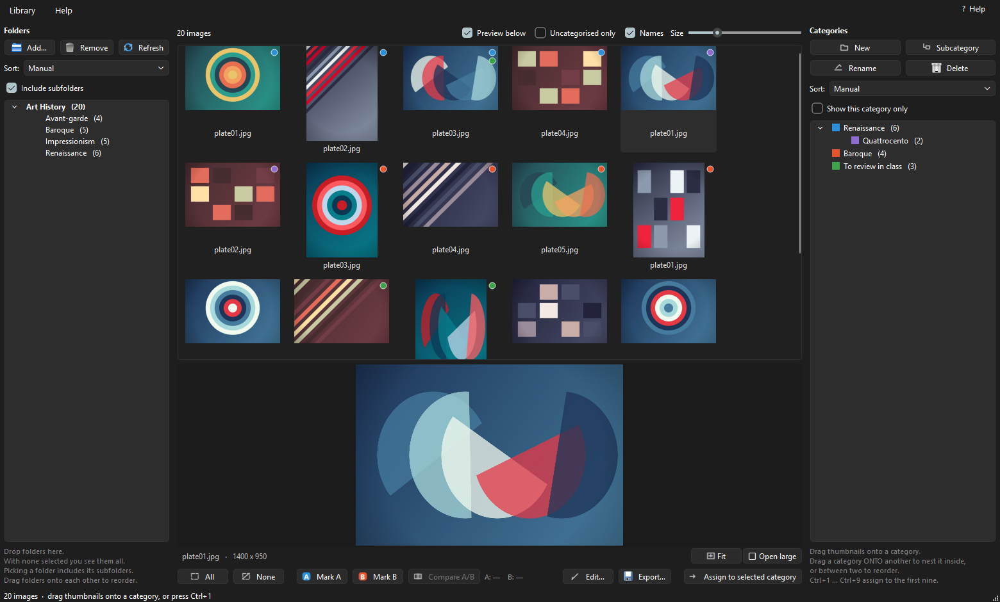
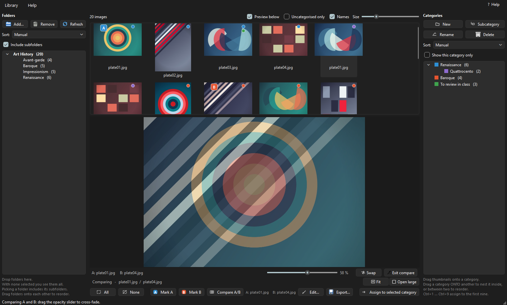
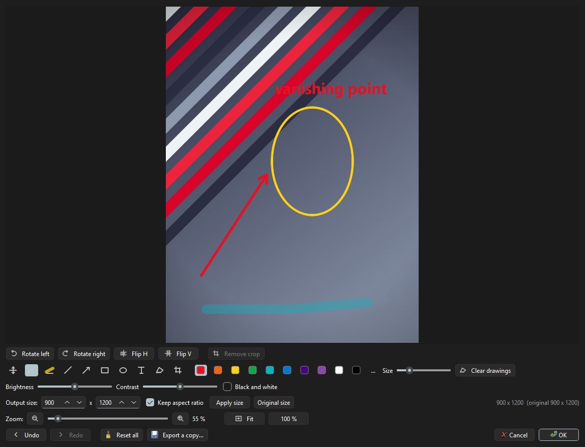

# DriloBoard - Image viewer and reviewer

**An image board for teachers.** Drop in folders of images, see them as
thumbnails, sort them into categories of your own, compare two side by side
with an opacity slider, and annotate them — all without ever touching the
original files.

Built for preparing visual material for class: art history slides, reference
sheets, before/after comparisons.

> Manual en español: [README.es.md](README.es.md)



<sub>Folders on the left, thumbnails and a full-resolution preview in the
middle, your own categories on the right. The images shown are generated
samples, not real artwork.</sub>

---

## The one thing worth knowing

**DriloBoard never modifies your image files.**

Categories, crops, rotations, colour adjustments and drawings are stored as
*instructions* in a small `biblioteca.json` file and applied on the fly to the
thumbnail and the preview. That means:

- One image can live in several categories at once.
- Any edit can be undone months later — nothing was destroyed.
- Deleting a category never deletes a picture.

When you want real edited files, **Export** writes copies at full resolution
into a folder you choose, and leaves the originals alone.

## Features

**Folders (left column)**
Drag folders in from the file manager. Tick *Include subfolders* and each one
becomes a tree at any depth, with per-branch image counts; empty and hidden
subfolders are left out. Order them by hand or A→Z / Z→A. Files are sorted
naturally, so `plate2` comes before `plate10`.

**Thumbnails and preview (centre)**
Adjustable size (64–420 px), generated in background threads with an on-disk
cache. *Preview below* splits the column and shows the selected image large
underneath at full resolution — arrow through the thumbnails and the preview
follows. Double-click opens a large window with zoom, pan and fullscreen.

**A/B comparison**
Mark one image as **A** and another as **B** — the marks stay put while you
browse other folders — and the two are overlaid with an **opacity slider** to
cross-fade between them. For before/after restorations, two versions of a
painting, or a sketch over the finished work. Differently sized images are
fitted and centred, never stretched.



**Categories (right column)**
Create them, **nest them by dragging one onto another**, reorder them. A
parent's count includes its children without counting an image twice. Assign
by dragging thumbnails onto a category or with `Ctrl+1` … `Ctrl+9`. *Show this
category only* turns the centre into that category and everything below it,
whatever folder the images came from.

**Non-destructive editor**
Rotate, flip, crop, brightness, contrast, black and white, output size. Plus
**drawing tools** like a snipping tool — pen, highlighter, line, arrow,
rectangle, ellipse and text, in ten colours. Drawings are *objects, not
pixels*: the eraser removes the whole stroke you click on, and if you rotate
the image afterwards, the drawing rotates with it. Right-click rotates or
flips every selected image at once.



**Undo everywhere**
`Ctrl+Z` covers the lot — edits, assignments, categories, folders — for the
last 40 steps, and the status bar says what was undone.

**Portable library**
*Library ▸ Export library…* saves the whole classification to one file, with
paths stored **relative to a common root**, so it survives moving to another
computer or another drive. On import DriloBoard asks where the images are now
and repoints everything; you can *Replace* or *Merge*, and merging never
overwrites your own edits.

## Getting it running

### Prebuilt Windows package

Download the ZIP from [Releases](../../releases), unpack it anywhere — hard
disk, USB stick, network share — and run `DriloBoard.exe`. Nothing is
installed and nothing is written to the registry.

Your library and the thumbnail cache are created **inside that same folder**,
so copying the folder carries your whole classification with it.

The executable is not code-signed, so Windows will warn about an unknown
publisher the first time: *More info* → *Run anyway*.

To check a copy arrived intact: `DriloBoard.exe --selftest` starts the app
headlessly, opens the help, verifies the icons and image codecs, and exits
with status 0 if everything is in place.

### From source

Needs Python 3.10+.

```bash
python -m venv .venv
.venv/bin/python -m pip install PySide6-Essentials    # .venv\Scripts\ on Windows
.venv/bin/python driloboard.py
```

Or use the launchers: `DriloBoard.bat` on Windows, `./driloboard.sh` on Linux
(which creates the environment for you on first run).

The same single file runs on Windows and Linux. **Linux has not been tested in
anger** — the code is platform-agnostic and uses no Windows-only calls, but if
you try it there, reports are welcome.

## Keyboard

| Key | |
|---|---|
| `V` | show / hide the preview below |
| `A` / `B` | mark the chosen image as A or B |
| `C` | compare A and B |
| `E` | open the editor |
| `0` | fit the image in view |
| `Ctrl+1` … `Ctrl+9` | assign to the first nine categories |
| `Ctrl+Z` / `Ctrl+Y` | undo / redo |
| `F5` | re-read the folders from disk |
| `F1` | help |

There is a **? Help** button in the top-right corner with a full guide that
stays open while you work.

## Where your things live

Everything sits next to the program:

| | |
|---|---|
| `biblioteca.json` | folders, categories, assignments, edits and drawings |
| `cache/` | thumbnails already generated — safe to delete, it rebuilds |

<details>
<summary><b>Tuning for large libraries</b></summary>

Constants at the top of `driloboard.py`:

| Constant | Default | What it does |
|---|---|---|
| `THUMB_RAM_MB` | 256 | Ceiling for thumbnails held in memory. Past it, least-recently-seen ones are dropped. Without it, browsing 10,000 images at 420 px used over 4 GB. |
| `THUMB_QUEUE_MAX` | 400 | Pending thumbnail requests. The most recent wins — what you are looking at now — and requests for what you scrolled past are dropped. |
| `CACHE_MAX_MB` | 500 | On-disk cache ceiling, trimmed oldest-first at startup in the background. |
| `THUMB_BOX` | 512 | Size thumbnails are cached at. |
| `EDIT_PREVIEW_MAX` | 2400 | Working resolution of the editor. It opens with a reduced copy and loads the full original behind your back. |
| `MAX_PIXELS` | 80 M | Safety ceiling; larger images are scaled down to display, with a note. |

</details>

## Development

```bash
.venv/bin/python tests/correr_tests.py     # seven suites, ~13 s, no windows opened
```

The suites run headless (`QT_QPA_PLATFORM=offscreen`) and use their own state
file, so they cannot touch your library. They cover, among other things:

- The coordinate mapping for crops and drawings across **14 combinations of
  transformations × 5 regions each** — including a check that the test itself
  can tell regions apart, so it cannot pass by accident.
- That **neither editing nor exporting modifies the original file**, verified
  against its timestamp and size.
- The memory ceiling, the queue priority and the cache pruning.
- That every shortcut the in-app help advertises actually exists.

Rebuilding the Windows package:

```bash
.venv/bin/python -m PyInstaller DriloBoard.spec --noconfirm
```

Delete `dist/DriloBoard/cache/` before zipping — any test run creates it. The
application icon is generated from code, so there are no image assets to keep
in sync.

## Licence

MIT — see [LICENSE](LICENSE).

The prebuilt package bundles Qt via PySide6, which is used under the LGPL v3.
See [THIRD-PARTY-NOTICES.md](THIRD-PARTY-NOTICES.md) for the details and for
what that means if you redistribute the binary.
